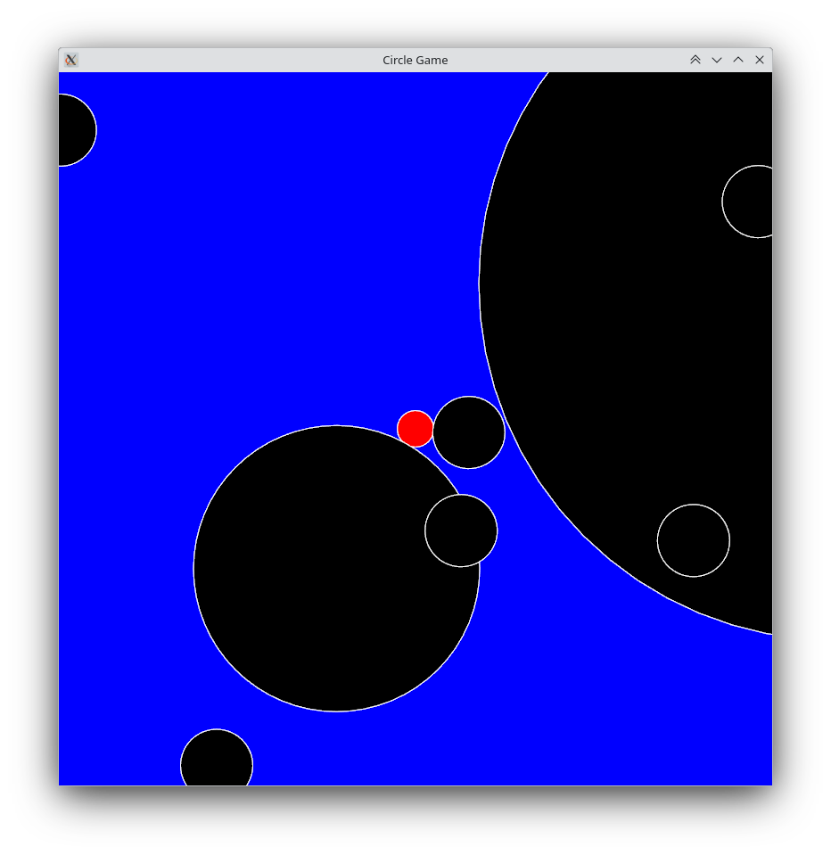

## How to Build?

Run "cmake -C build" from the root directory. Then build with "make -C build". CMake will take a while to complete, due to it having to fetch SFML from the SFML github repository, this may take up to a few minutes. After successfully building, run "./build/circlegame" to execute the program.

    
